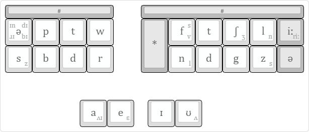

# phenrsteno

Phonemic and non-rhotic English stenotype system for [Plover](https://github.com/openstenoproject/plover "Plover GitHub repository"). The layout is optimised for RP and Midlands stenographers.

# Chorded phonemes

This sections describes how you can transcribe phonemes other than those printed on the keys.

## Vowels

Diphthongs like \[aɪ\] and \[eɪ\] arise naturally from the layout. Strokes for other vowel sounds are in the table below.

| Vowel  | Stroke |
| :----- | :----- |
| \[ɒ\]  | `ae`   |
| \[iː\] | `ɪʊ`   |
| \[uː\] | `eʊ`   |
| \[ɑː\] | `aɪʊ`  |
| \[ɔː\] | `aeɪʊ` |
| \[əʊ\] | `aeʊ`  |

## Consonants

Phonemes under the left hand:

| Initial consonant | Left-hand stroke |
| :---------------- | :--------------- |
| \[f\]             | `sb`             |
| \[v\]             | `sd`             |
| \[k\]             | `pb`             |
| \[l\]             | `td`             |
| \[j\]             | `wr`             |
| \[tʃ\]            | `twr`            |
| \[dʒ\]            | `dwr`            |
| \[ʃ\]             | `swr`            |
| \[g\]             | `pt`             |
| \[h\]             | `ptw`            |
| \[n\]             | `bd`             |
| \[m\]             | `bdr`            |
| \[θ\]             | `bt`             |

Phonemes under the right hand:

| Final consonant | Right-hand stroke |
| :-------------- | :---------------- |
| \[p\]           | `ft`              |
| \[b\]           | `ftʃ`             |
| \[k\]           | `td`              |
| \[θ\]           | `tdʃ`             |
| \[ŋ\]           | `ng`              |
| \[m\]           | `ftnd`            |

# Development

To-do:

  - [x] Integrate with [Plover’s plugin manager](https://github.com/benoit-pierre/plover_plugins_manager "Plover Plugin Manager GitHub repository")
  - [ ] Include JSON dictionaries for
      - [ ] vocabulary
          - [ ] divide into `vocabulary.json` and `affixes.json`
      - [x] punctuation
      - [x] plover commands
  - [ ] Move explanations to the wiki
  - [ ] Write installation instructions in README.md
