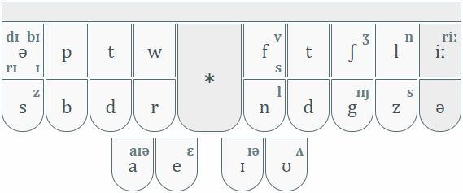
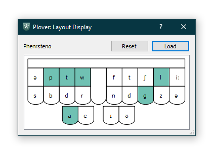

# Phenrsteno

Non-rhotic phonemic steno theory, dictionary and plugin for [Plover].

## Installation

1.  Install [Plover 4.x.x]
2.  In the main Plover window, select `Plugins Manager` from the toolbar
3.  In the plugins list, find and select plover-phenrsteno and click `Install/Update`
4.  Quit (Ctrl-q) and re-open Plover
5.  In the main Plover window, select `Configure`, go to the `System`
    tab, select `Phenrsteno` from the dropdown box and click `OK`
6.  Optionally download [layout-display.json] and load it into Ted Morin's [layout display plugin].

## Usage

Once installed, you need to load a dictionary. You can download the
dictionaries from this repository.

-   `vocabulary.json` contains some 6 thousand or so affixes, words and phrases
-   `verbatim.json` is for fingerspelling individual letters

Once you're set up, check out the [wiki] and start writing with Phenrsteno!

[Plover]: https://github.com/openstenoproject/plover
[Plover 4.x.x]: https://github.com/openstenoproject/plover/releases
[layout-display.json]: layout-display.json
[layout display plugin]: https://github.com/morinted/plover_layout_display
[wiki]: https://github.com/chambln/plover-phenrsteno/wiki
