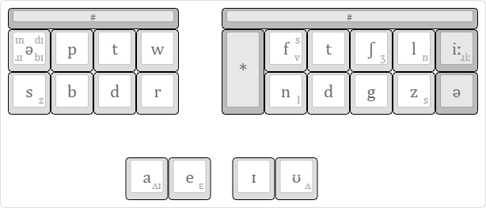

# What is Phenrsteno?

Phenrsteno is a truly phonetic stenotype system for [Plover](https://github.com/openstenoproject/plover "GitHub repository for Plover"). It’s optimised for non-rhotic accents such as Received Pronuncation, but really anyone might like to use it.

The symbols printed on the keys are [IPA](https://en.wikipedia.org/wiki/IPA) symbols, and they represent [phonemes](https://en.wikipedia.org/wiki/Phoneme)—the elemenatary units of sound that make up words. This allows Phenrsteno to be completely phonetic and independent of spelling.

## Etymology

Phenrsteno (/ˌfεnə’stεnəʊ/) is a very aggressive portmanteau of PHonemic English Non-Rhotic Steno.
